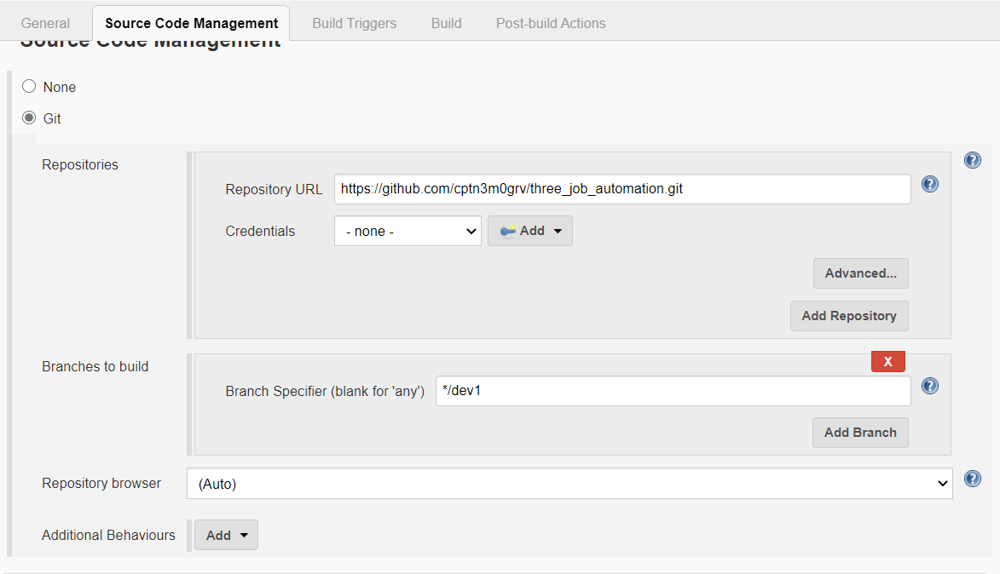
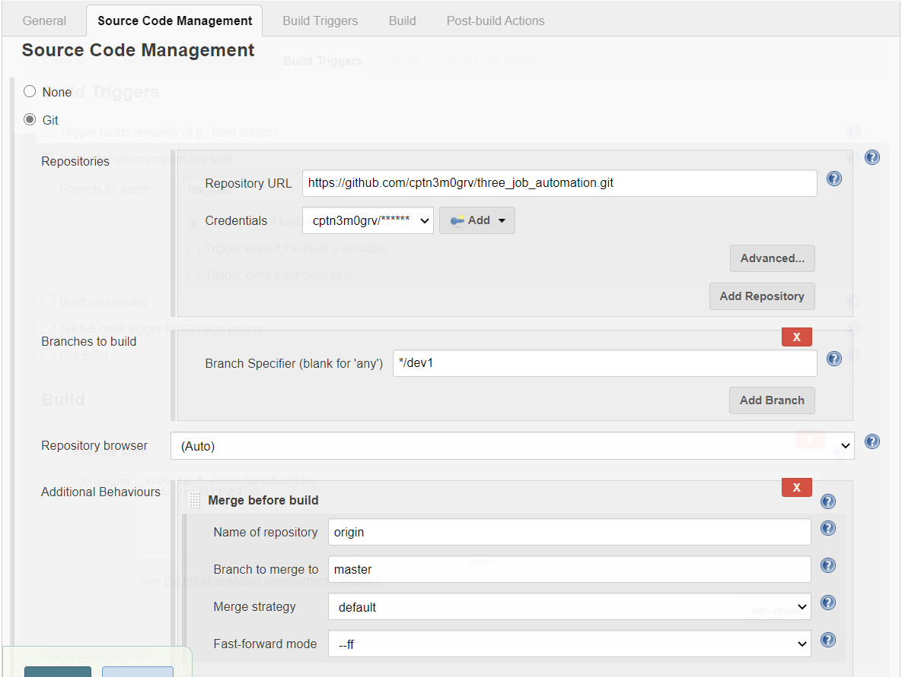
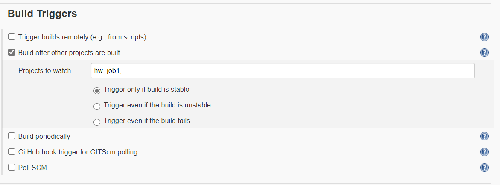
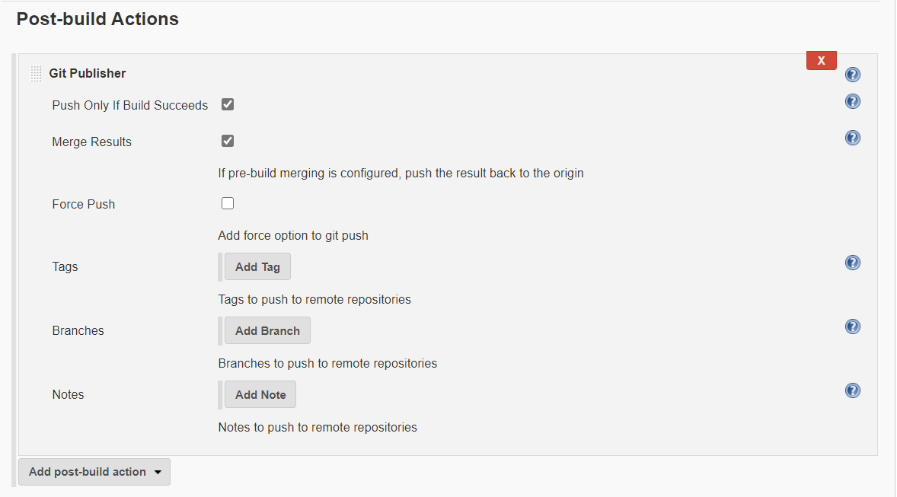

# Jenkins_automation
This project is based on jenkins automation with the help of git, github and docker

*Jenkins is a free and open source automation server. It helps automate the parts of software development related to building, testing, and deploying, facilitating continuous integration and continuous delivery. It is a server-based system that runs in servlet containers such as Apache, Tomcat.*

*Docker is a set of platform as a service products that uses OS-level virtualization to deliver software in packages called containers. Containers are isolated from one another and bundle their own software, libraries and configuration files; they can communicate with each other through well-defined channels.*

## Requirements
These are the following requirements for the following project
### Jenkins
--> Some basic knowledge of job chaining
--> Github and Git Merge plugins should be installed
### Git and Github
--> Basic knowledge of branching and merging in git and github
### Docker
--> Some advanced knowledge of docker, like volumne mounting and exposing the docker image
--> httpd docker image
   Use command 
   docker pull httpd
### Linux and Bash
--> Core knowledge of linux file systems, permissions and bash scripting

## About the project
This project containes of 3 jenkins jobs, 
### Job1
--> It will keep track of test environment, and if any changes are made in the testing branch, it will load it on a new webserver everytime which will function exactly like the main production server.
--> If the server runs fine and there are no error, it will pass it to the Quality Assurance Team (QAT)

### Job2
--> It is the main task of the automation, this task will only execute if QAT merges the code with the master branch, this job deals with the master branch of repo and will not make any changes to the website unless everything is fine.

### Job3 
--> This job will act as QAT, and if everything works fine in the test server, it will merge the code with the master branch of github repo.

## Below are the detailes description and features used in every job of github with screenshots

### Job1 
This job1 will track dev1 branch.
Then it will copy all these files to a directory, which will then be mounted to the test docker image (this docker image will only be for testing and thus be creates fresh evrytime there is a change in github repo), to manage this the first job will also execute a bash script (job1.sh) .

### Job2
This job2 will track master branch.
This job will only run if job3 is successful.
Then it will copy all these files to a different directory, which will then be mounted to the main production docker image (this docker image will be the same always), to manage this the second job will also execute a bash script (job2.sh) .

### Job3
This job3 will track the job1.
This job will only run if job1 is successful.
This job will merge the contents of dev1 branch to the master branch if testing goes successful, and this is the reason we will also have to provide the credentials of our github account.

